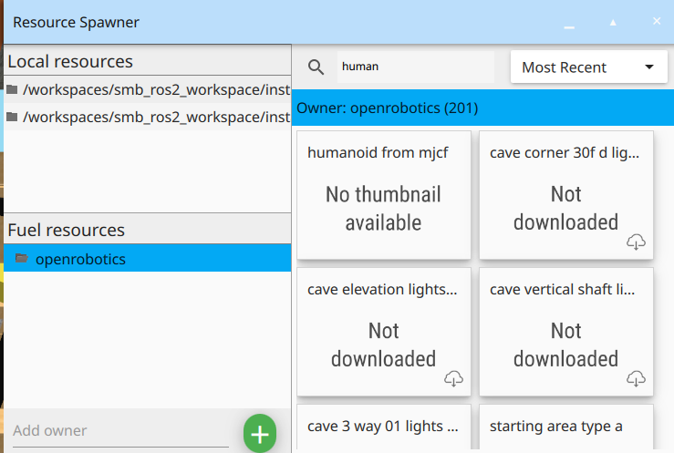

# 👀🎮 Visualization and Teleop

* Table of contents
{:toc}

The goal of this section is to run the robot simulation using Gazebo, visualise the SMB robot in RViz, control the robot.

First of all, make sure the `smb_gazebo` has been already built successfully.

```bash
# In the host pc, build the smb_gazebo package if you haven't already
 smb_build_packages_up_to meta_smb_sim
```

## 👀 Visualisation

Run the following commands in the host pc to visualise the robot.

```bash
# In the host pc
ros2 launch smb_gazebo gazebo.launch.py
```

To run the simulation you do not need a connection to SMB.

{: .important } 
Wait until gazebo launches.

<p align="center">
  
</p>


To run the state estimation and mapping use the following command.

```bash
ros2 launch smb_bringup smb_sim_se.launch.py
```

<p align="center">
  
</p>

## 🎮 Teleoperation

You can drive the robot with the keyboard. If you want to drive the robot, make sure that the terminal where you launched the simulation (i.e. where the [`teleop_twist_keyboard`](http://wiki.ros.org/teleop_twist_keyboard) node is running) is selected while pressing the keys. To use the keyboard run the following alias:

    ```bash
    # In the host pc
    smb_teleop_twist_keyboard
    ```

    - Use the following keys to move:

        | u | i | o |
        | j | k | l |
        | m | , | . |

    - Use the following keys to control speed:

        - `q/z`: Increase/decrease max speeds by 10%
        - `w/x`: Increase/decrease only linear speed by 10%
        - `e/c`: Increase/decrease only angular speed by 10%

    - Use any other key to stop.

# 🧭 Navigation
The goal of this section is to run the robot simulation using Gazebo, visualise the SMB robot in RViz, putting waypoints and goalpoints to demonstrate the autonomous capabilities of the robot.

```bash
# In the host pc
ros2 launch smb_bringup smb_sim_navigation.launch.py 
```

<p align="center">
  
</p>

# 🔍 Exploration

In this section we will see a fully autonomous robot exploring the environment working with far planner and ground truth.🥳

```bash
# In the host pc
ros2 launch smb_bringup smb_sim_exploration.launch.py
```

<p align="center">
  
</p>

# 🕵️‍♂️ Object Detection

In this section, we'll demonstrate how to perform object detection on the SMB robot using a YOLOv5 model. This includes downloading the model, launching detection nodes, adding objects in simulation, and visualizing detections in RViz.

Create a new folder models in `/smb_ros2_workspace/src/detection/object_detection/object_detection/models`

Place yolov5l.onnx file inside this directory
```bash
wget -O src/perception/smb_object_detection/object_detection/models/yolov5l6.onnx https://pub-3ad3dd2988de4537a845ed6aaa048dc4.r2.dev/yolov5l6.onnx
```

`smb_build_packages_up_to object_detection object_detection_msgs`

And now it is time to launch:

```bash
# In the host pc
ros2 launch smb_bringup gazebo.launch.py
```
```bash
ros2 launch object_detection object_detection.launch.py
```

Start with adding objects in sim.
Scroll down and download the object you want: 

<div style="display: flex; justify-content: center; align-items: center; gap: 40px; margin-bottom: 40px;">
  
  
</div>


Here we choose a humanoid...
<p align="center">
  
</p>
But its lying on the ground, how do we get it up?

<div style="display: flex; justify-content: center; align-items: center; gap: 40px; margin-bottom: 40px;">
  
  
</div>


To move the humanoid: click apply force torque and mouse drag with 
```bash
Ctrl + right click
```
<div style="display: flex; justify-content: center; align-items: center; gap: 40px; margin-bottom: 40px;">
  
  
</div>


Now, we are trying with another object

<div style="display: flex; justify-content: center; align-items: center; gap: 40px; margin-bottom: 40px;">
  
  
</div>


launch rviz in a seperate terminal
```bash
rviz2
```
<p align="center">
  
</p>

Add `Image` from `rviz_default_plugins` and change the topic to `detections_in_image` and here is what you would expect to see.

<p align="center">
  
</p>